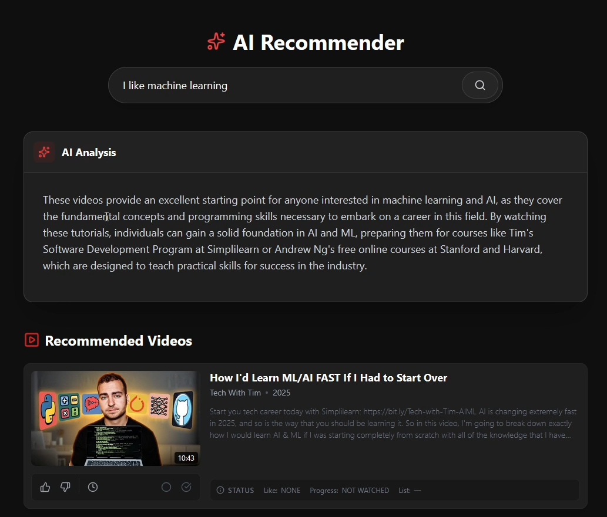
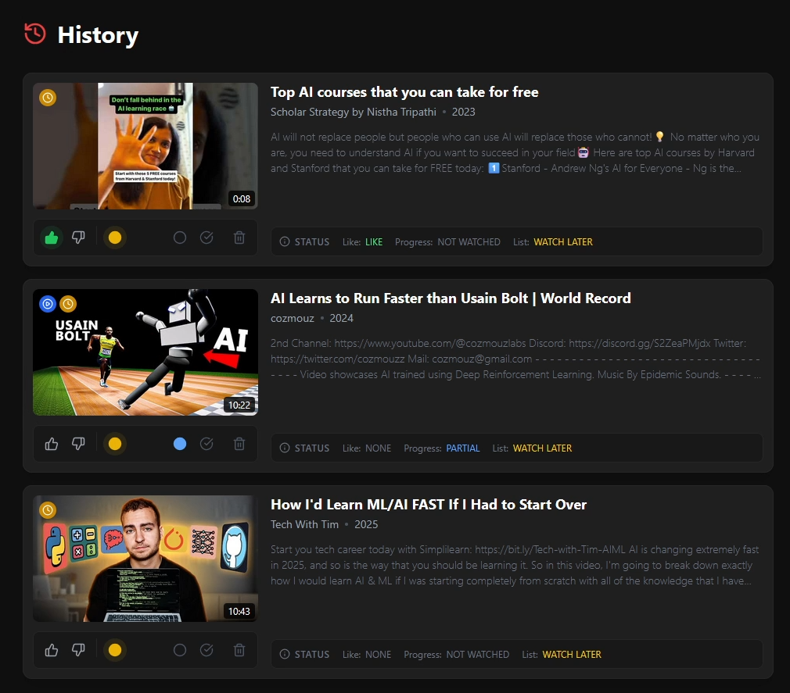
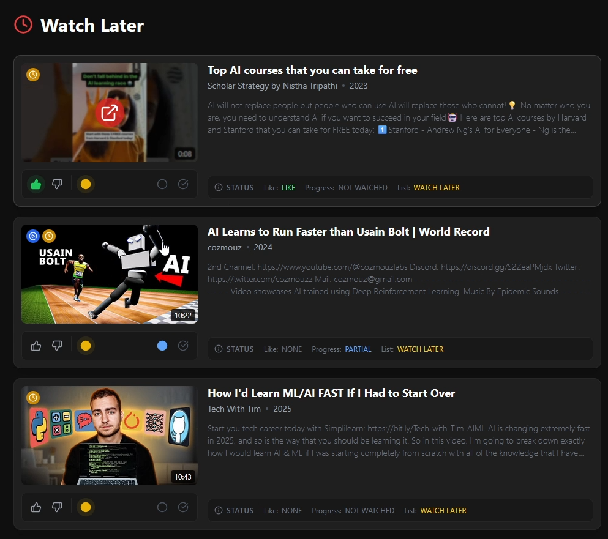

# YouTube AI Recommender

A smart video recommendation engine powered by Spring AI and Vector Embeddings (RAG). This application analyzes video content semantics to provide personalized recommendations, distinct from traditional keyword matching.

It features a modern React frontend and a robust Spring Boot backend with a PostgreSQL (pgvector) database.

## Screenshots

| Home & AI Search | AI Analysis |
|:---:|:---:|
|  |  |
| **Watch Later** | **Content Ingestion** |
|  |  |

---

## Tech Stack

### Backend
* **Java 21** & **Spring Boot 3.4**
* **Spring AI** (Integration with OpenAI API)
* **Youtube API V3**
* **Hibernate / JPA** (ORM)
* **PostgreSQL** + **pgvector extension** (Vector Database)
* **Docker** (Containerization)

### Frontend
* **React.js** (Vite)
* **Tailwind CSS** (Styling)
* **Lucide React** (Icons)
* **Axios** (API Client)

---

## Key Features

* **Semantic Search:** Finds videos based on meaning ("I want to learn Java") rather than just keywords.
* **AI Explanations:** Generates a unique paragraph explaining why the videos were recommended using GPT.
* **Granular Interactions:**
    * Like / Dislike
    * Watch Later list
    * Partial / Full Watch status
* **User History:** Tracks watched videos and manages library.
* **Responsive UI:** Fully responsive Sidebar and Layout for Mobile/Desktop.

---

## Setup & Installation

### Prerequisites
* Java 17 or 21
* Node.js & npm
* Docker Desktop (for the Database)
* YouTube API V3 Key

### 1. Clone the Repository
```bash
git clone [https://github.com/andreicosmin02/youtube-recommender.git](https://github.com/andreicosmin02/youtube-recommender.git)
cd youtube-recommender